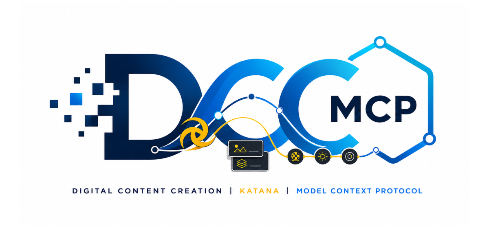

# dcc-mcp-katana

<p align="center">
  
</p>

## Agent workflow

AI agents should use the shared gateway through `dcc-mcp-cli`; IDE users may
continue to use the MCP endpoint. Prefer typed skills and tools over raw scripts.

```bash
dcc-mcp-cli dcc-types
dcc-mcp-cli list
dcc-mcp-cli search --query "<task>" --dcc-type katana
dcc-mcp-cli describe <tool-slug>
dcc-mcp-cli call <tool-slug> --json '{"key":"value"}'
```

`dcc-types` reports release-catalog support; `list` reports live sessions. If a
tool belongs to an inactive progressive skill, call `dcc-mcp-cli load-skill <skill-name> --dcc-type katana` before retrying. For post-task improvement,
attach a stable session id with `--meta-json`, query `dcc-mcp-cli stats --range 24h --session-id <task-id>`, then pass the bounded evidence to the
`review_skill_improvement` prompt from `dcc-mcp-skills-creator`.


MCP adapter for Foundry Katana. It runs typed NodegraphAPI operations on Katana's event-processing thread.

```bash
pip install dcc-mcp-katana
```

Add the installed `dcc_mcp_katana/katana_plugin` directory to `KATANA_RESOURCES`, then start Katana. Each adapter instance uses an OS-assigned port and registers it for CLI discovery. Connect through the stable gateway at `http://127.0.0.1:9765/mcp`; set `DCC_MCP_KATANA_PORT` only when a fixed direct endpoint is required.

## Tools

- `katana-nodegraph.inspect_nodegraph`
- `katana-nodegraph.list_nodes`
- `katana-nodegraph.save_project`

`save_project` changes files and requires an absolute `.katana` path.
