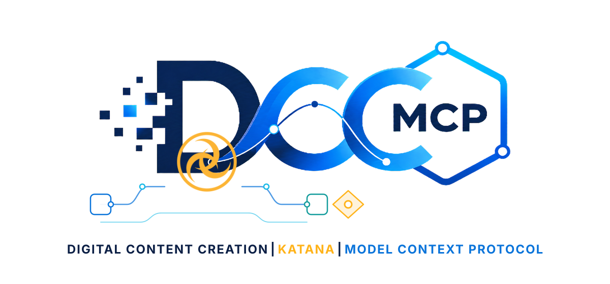

# dcc-mcp-katana

<p align="center">
  <picture>
    <source media="(prefers-color-scheme: dark)" srcset="docs/assets/dcc-mcp-katana-dark.svg">
    <source media="(prefers-color-scheme: light)" srcset="docs/assets/dcc-mcp-katana.svg">
    
  </picture>
</p>

Typed DCC-MCP control for Foundry Katana's node graph. Host work is marshalled
through Katana's native event queue and runs on the event-processing thread.
The adapter deliberately does not expose arbitrary Python, parameter
expressions, render scripts, or shell commands.


_Illustrative workflow generated with OpenAI ImageGen from the retained source in `docs/images/sources`; it is not a Katana screenshot or host-validation artifact._

## Install in Katana's Python environment

See the canonical [Install and upgrade](install.md) runbook for supported versions, explicit
host/Python overrides, status, verification, rollback, upgrade, and receipt-driven uninstall.

```bash
python -m pip install dcc-mcp-katana
dcc-mcp-katana install --dry-run --json
dcc-mcp-katana install --yes --json
```

The installer writes an adapter-owned launcher that preserves the existing
`KATANA_RESOURCES` entries; it does not modify shell profiles or registry keys. Run the
machine-executable launcher returned in `next_steps`, then check the installation:

```bash
dcc-mcp-katana doctor --json
dcc-mcp-katana verify --json
dcc-mcp-cli load-skill katana-nodegraph --dcc-type katana
```

Each instance uses an OS-assigned port and registers with DCC-MCP discovery.
Agents should use the stable local gateway at `http://127.0.0.1:9765/mcp`;
`DCC_MCP_KATANA_PORT` is only for a deliberately fixed direct endpoint.

## Typed tools

Diagnostics and inspection:

- `get_status`
- `inspect_nodegraph`
- `list_nodes`
- `get_node`
- `get_parameter`

Node authoring:

- `create_node`
- `rename_node`
- `delete_nodes`
- `set_node_position`
- `select_nodes`
- `set_parameter_value`

Graph and project control:

- `add_port`
- `remove_port`
- `connect_ports`
- `disconnect_ports`
- `set_timeline`
- `save_project`

`list_nodes` is paginated and capped at 1,000 results. Selection and deletion
are capped at 100 nodes. Parameter writes accept only JSON strings, booleans,
or finite numbers. Deletion and port removal require `confirm=true`.

## Safe project output

`save_project` accepts only absolute `.katana` paths inside
`DCC_MCP_KATANA_ALLOWED_ROOTS`. The variable uses the platform path separator
and defaults to the current user's home directory when unset. Existing files
require `overwrite=true`; missing parent directories require
`create_parents=true`. A successful result includes the file size and SHA-256.

## Main-thread and timeout contract

At most 32 host calls may be pending. A timeout before Katana starts an
operation cancels that operation. A timeout after execution starts reports an
unknown final host outcome, so callers must inspect the graph before retrying a
non-idempotent operation. Tool schemas carry main-thread affinity and bounded
timeouts through the shared `HostExecutionBridge`.

## Real-host smoke test

Open a disposable Katana project, configure an existing writable directory in
both `DCC_MCP_KATANA_ALLOWED_ROOTS` and `DCC_MCP_KATANA_SMOKE_ROOT`, then run:

```bash
python tools/live_katana_smoke.py
```

The smoke test uses `dcc-mcp-cli` for discovery, readiness, skill loading, and
typed calls. It creates a `PrimitiveCreate`/`Merge` graph, adds and connects
ports, changes a typed parameter and timeline, saves a `.katana` file, and
prints its byte count and SHA-256. Set `DCC_MCP_KATANA_SMOKE_CLEANUP=1` only if
the two generated nodes should be deleted after evidence is collected.

The repository's automated tests use a contract-compatible fake Katana API;
they are not represented as real-host evidence. A production release should
retain the real Katana version, typed CLI transcript, project hash, and visual
node-graph evidence.

## Development

```bash
python -m pip install -e ".[dev]"
python -m pytest -q
python -m ruff check src tests tools
python -m ruff format --check src tests tools
python tools/lint_skills.py
python -m build
python -m twine check dist/*
```

Agent workflows should use `dcc-mcp-cli search`, `describe`, and `call` rather
than bypassing typed tools. If a tool is not visible, load the progressive
`katana-nodegraph` skill first.
